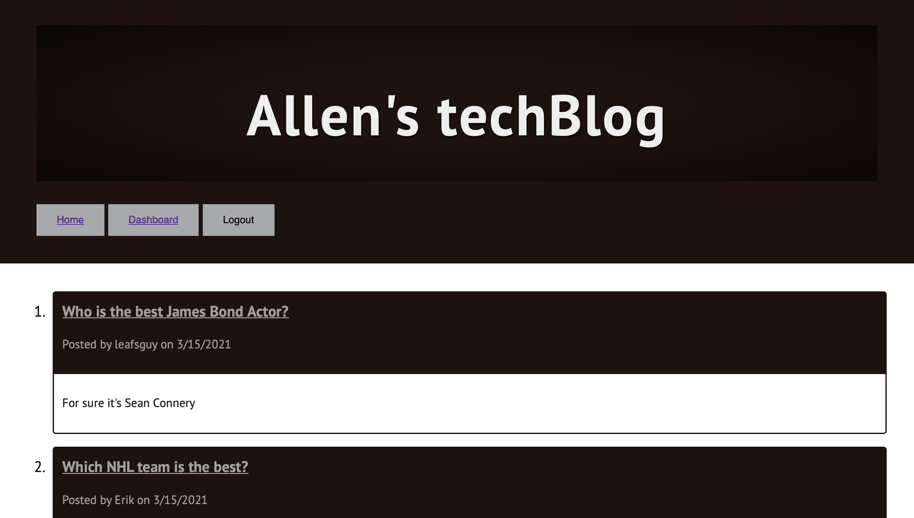

<h1 align="center">Model View Controllers</h1>
  
 

## Description
Allen's Tech Blog allows you to post your own conversations, edit them or delete them. You can also view posts made by others!

## Table of Contents
- [Description](#description)
- [Installation](#installation)
- [Usage](#usage)
- [Screenshot](#screenshot)
- [Deployed](#deployed)
- [License](#license)
- [Contributing](#contributing)
- [Testing](#testing)
- [Questions](#questions)
- [Contact](#contact)

## Installation

Local Machine: 
Clone repository -> 
Command Line: npm i 
Command Line: npm i express 
Command Line: npm i --save seqeulize 
Command Line: npm i dotenv 
Command Line: npm start

Browser link: https://localhost:3001

 
Remote:
Visit Deployed Link https://techblog-uoft.herokuapp.com

## Usage
View, Post, Edit or Delete your own blog conversations

## Screenshot

## Deployed
https://frozen-fortress-86170.herokuapp.com 

## License

 
This application is covered by the MIT license. 

## Contributing
Visit repo link to contribue. https://github.com/alovatt83/ExpressJS-Notes

## Testing
Tested on macOS Big sur

## Questions
Report any discovered issues here: allenlovatt@gmail.com 
 

## Contact
Find me on GitHub: [alovatt83](https://github.com/alovatt83) 
 
Call me @: 905-555-7925
 
Email me with any questions: allenlovatt@gmail.com  

This ReadMe Generator Was Made by [ADL Software Solutions](https://github.com/alovatt83/ReadMe-Generator)
